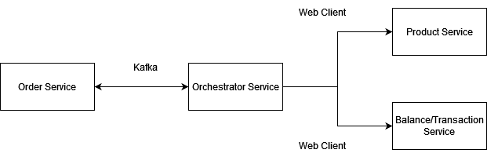
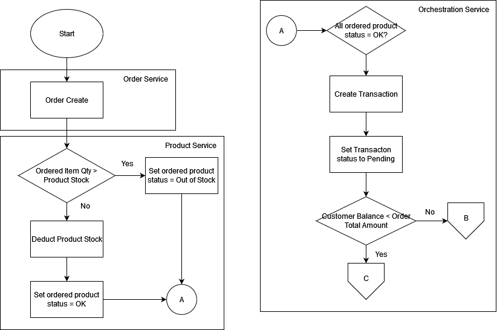
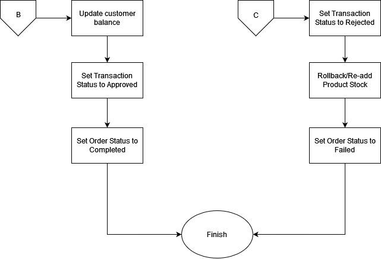

# Java Mircoservice Marketplace

## Table of Content
- [Description](#description)
- [Mind map](#mind-map)
- [Features](#features)
- [Tech Stack](#tech-stack)
- [Run locally](#run-locally)

## Description
This project simulate (mini) SAGA Pattern microservice using Java Reactive in marketplace project.

## Mind Map
This project structure is roughly like this:



The flow can be seen from this flowchart:




## Features
This program only has one flow which ordering an item, but this program also has rollback feature which if user balance is less than total price order, then the product stock will be automatically rollbacked.

## Tech Stack
Tech stack used in this project is:
1. [Java](https://www.java.com/)
2. [Spring Boot](https://spring.io)
3. [Spring Reactive](https://mvnrepository.com/artifact/org.springframework.boot/spring-boot-starter-webflux)
4. [R2DBC](https://r2dbc.io/)
5. [Jakarta Validation](https://beanvalidation.org/)
6. [PostgreSQL](https://www.postgresql.org/)
7. [Apache Kafka](https://kafka.apache.org/)
8. [Swagger](https://swagger.io/)

## Run Locally
You can run this project in your computer by cloning this project and make sure you have this programs installed
1. [PostgreSQL](https://www.postgresql.org/)
2. [Java](https://www.java.com/)
3. [Apache Kafka](https://kafka.apache.org/)

After that you can follow this steps:
1. Connect to your PostgreSQL server
2. You can write your own database config and name in application.properties file but each service have their own database and table which look like this sql schema below:
```sql
CREATE DATABASE marketplace_balance;

-- below is tables inside marketplace_balance database for balance service
CREATE TABLE balance (
    id SERIAL PRIMARY KEY,
    balance FLOAT8 NOT NULL
);

CREATE TABLE transaction (
    id SERIAL PRIMARY KEY,
    amount FLOAT8 NOT NULL,
    order_id BIGINT NOT NULL,
    payment_date TIMESTAMP DEFAULT CURRENT_TIMESTAMP,
    mode VARCHAR(255) NOT NULL,
    status VARCHAR(255) NOT NULL,
    reference_number VARCHAR(255) NOT NULL
);

CREATE DATABASE marketplace_order;

-- below is tables inside marketplace_order database for order service
CREATE TABLE order_item (
    id SERIAL PRIMARY KEY,
    price FLOAT8 NOT NULL,
    product_id BIGINT NOT NULL,
    quantity INTEGER NOT NULL,
    order_id BIGINT NOT NULL
);

CREATE TABLE orders (
    id SERIAL PRIMARY KEY,
    billing_address VARCHAR(255) NOT NULL,
    customer_id BIGINT NOT NULL,
    order_date TIMESTAMP DEFAULT CURRENT_TIMESTAMP,
    order_status VARCHAR(255) NOT NULL,
    payment_method VARCHAR(255) NOT NULL,
    shipping_address VARCHAR(255) NOT NULL,
    total_amount FLOAT8 NOT NULL
);

CREATE DATABASE marketplace_product;

-- below is table, function, and trigger inside marketplace_product for product service
CREATE TABLE product (
    id SERIAL PRIMARY KEY,
    name VARCHAR(255) NOT NULL,
    price FLOAT8 NOT NULL,
    category VARCHAR(255)[],
    description VARCHAR(255) NOT NULL,
    image_url VARCHAR(255) NOT NULL,
    stock_quantity INTEGER NOT NULL,
    created_at TIMESTAMP DEFAULT CURRENT_TIMESTAMP,
    updated_at TIMESTAMP DEFAULT CURRENT_TIMESTAMP
);

CREATE OR REPLACE FUNCTION update_updated_at_column()
RETURNS TRIGGER AS $$
BEGIN
    NEW.updated_at = NOW();
    RETURN NEW;
END;
$$ LANGUAGE plpgsql;

CREATE TRIGGER set_updated_at
BEFORE UPDATE ON my_table
FOR EACH ROW
EXECUTE FUNCTION update_updated_at_column();
```
3. Go to the dto folder and run the command
```bash
$ mvn clean install
```
to install dto to maven local repository to use it as dependencies for other service.
4. Run zookeeper and kafka server.
5. Run each service excluding dto since dto already included in other service as dependencies.